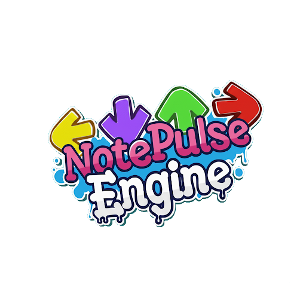

# NotePulse Engine
### What a shitty name

This engine is a fork of Psych 0.7.3, made with the purpose of being easier to mod and add features that either standard Psych did not have, or were available in versions higher than its 0.7.3.

## What does it add?

- Replace hxCodec for hxVlc. (Preventing crashes)
- Judgement Counter.
- Marvelous Rating.
- Key count changes.
- Modcharting libraries ([FunkinModchart](https://github.com/theoo-h/FunkinModchart))
- Extra pair of strums for GF.
- Sustain splashes.
- Compatibility with Psych 1.0 charts.
- Possibility to force the camera to look at Girlfriend without being a gf section.
- Results screen.
- Play as opponent.
- Camera movement on note hit.
- Ndll support.
- Psych 1.0 Stage and Charting Editors.
- Modchart Events on Charting State (Inspired by [Zoro's Modcharting Tools](https://github.com/TheZoroForce240/FNF-Modcharting-Tools))
- Scripted States and Substates.
- CNE-like CustomShader utility.

###  You can find some help [here](LUA.md)

## Thanks
- **tposejank**: Extra Keys
- **Codename Engine**: NdllUtils and debug menu
- **Nightmare Vision Engine**: WindowUtils
- **Shadow Mario**: Psych Engine
- **FunkinModchart**: Modchart libraries
- **Funkin Crew**: Obvious, right?
